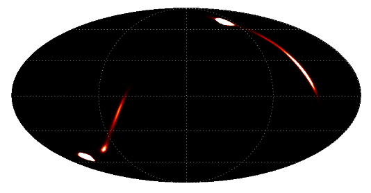

**************
HEALPIX images
**************

.. note:: Because the functions presented below use healpy, which is licensed
          under the GPLv2, any package using these funtions has to (for now)
          abide with the GPLv2 rather than the BSD license.

Images can also be stored using the HEALPIX representation, and the
*reproject* package includes two functions,
:func:`~reproject.reproject_from_healpix` and
:func:`~reproject.reproject_to_healpix`, which can be used to reproject
from/to HEALPIX representations (these functions are wrappers around
functionality provided by the `healpy <http://healpy.readthedocs.io>`_
package). These functions do the reprojection using interpolation (and the
order can be specified using the ``order`` argument). The functions can be
imported with::

    from reproject import reproject_from_healpix, reproject_to_healpix

The :func:`~reproject.reproject_from_healpix` function takes either a
filename, a FITS Table HDU object, or a tuple containing a 1-D array and a
coordinate frame given as an Astropy :class:`~astropy.coordinates.BaseCoordinateFrame`
instance or a string. The target
projection should be given either as a WCS object (which required you to also
specify the output shape using ``shape_out``) or as a FITS
:class:`~astropy.io.fits.Header` object.

To demonstrate these functions, we can download an example HEALPIX map which
is a posterior probability distribution map from the `LIGO project
<http://www.ligo.org/scientists/first2years/>`_::

    from astropy.utils.data import get_pkg_data_filename
    filename_ligo = get_pkg_data_filename('allsky/ligo_simulated.fits.gz')

We can then read in this dataset using Astropy (note that we access HDU 1
because HEALPIX data is stored as a binary table which cannot be in HDU 0)::

   from astropy.io import fits
   hdu_ligo = fits.open(filename_ligo)[1]

We now define a header using the
`Mollweide <http://en.wikipedia.org/wiki/Mollweide_projection>`_ projection::

    target_header = fits.Header.fromstring("""
    NAXIS   =                    2
    NAXIS1  =                 1000
    NAXIS2  =                  800
    CTYPE1  = 'RA---MOL'
    CRPIX1  =                  500
    CRVAL1  =                180.0
    CDELT1  =                 -0.4
    CUNIT1  = 'deg     '
    CTYPE2  = 'DEC--MOL'
    CRPIX2  =                  400
    CRVAL2  =                  0.0
    CDELT2  =                  0.4
    CUNIT2  = 'deg     '
    COORDSYS= 'icrs    '
    """, sep='\n')

All of the following are examples of valid ways of reprojecting the HEALPIX LIGO data onto the Mollweide projection:

* With an input filename and a target header::

    array, footprint = reproject_from_healpix(filename_ligo, target_header)

* With an input filename and a target wcs and shape::

    from astropy.wcs import WCS
    target_wcs = WCS(target_header)
    array, footprint = reproject_from_healpix(filename_ligo, target_wcs,
                                              shape_out=(240,480))

* With an input array (and associated coordinate system as a string) and a target header::

    data = hdu_ligo.data['PROB']
    array, footprint = reproject_from_healpix((data, 'icrs'),
                                               target_header, nested=True)

Note that in this case we have to be careful to specify whether the pixels
are in nested (``nested=True``) or ring (``nested=False``) order.

* With an input array (and associated coordinate system) and a target header::

    from astropy.coordinates import FK5
    array, footprint = reproject_from_healpix((data, FK5(equinox='J2010')),
                                              target_header, nested=True)

The resulting map is the following::

    from astropy.wcs import WCS
    import matplotlib.pyplot as plt

    ax = plt.subplot(1,1,1, projection=WCS(target_header))
    ax.imshow(array, vmin=0, vmax=1.e-8)
    ax.coords.grid(color='white')
    ax.coords.frame.set_color('none')

On the other hand, the :func:`~reproject.reproject_to_healpix` function takes
input data in the same form as :func:`~reproject.reproject_interp`
(see :ref:`interpolation`) for the first argument, and a coordinate frame as the
second argument, either as a string or as a
:class:`~astropy.coordinates.BaseCoordinateFrame` instance e.g.::

    array, footprint = reproject_to_healpix((array, target_header), 'galactic')

The array returned is a 1-D array which can be stored in a HEALPIX file using ``healpy.write_map``::

    from healpy import write_map
    write_map('healpix_map.fits', array)

.. note:: When converting to a HEALPIX array, it is important to be aware
          that the order of the array matters (nested or ring). The
          :func:`~reproject.reproject_to_healpix` function takes a ``nested``
          argument, and the ``write_map`` function from healpy takes a
          ``nest`` argument. Both default to `False`, so the above example
          works as expected.
