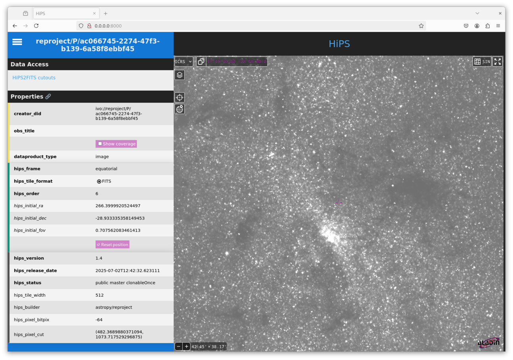

***************************************
HiPS (Hierarchical Progressive Surveys)
***************************************

.. warning:: The hips functionality in the reproject package is
             currently experimental, so use with care and please report
             issues at https://github.com/astropy/reproject

`HiPS (Hierarchical Progressive Surveys) <https://aladin.cds.unistra.fr/hips/>`_
is a standard that can be used to representing astronomical images by a series
of tiles at different resolutions. It is used for example by `Aladin
<https://aladin.cds.unistra.fr>`_.

The **reproject.hips** sub-package includes helper functions for constructing
HiPS datasets from a variety of inputs. The main function is
:func:`~reproject.hips.reproject_to_hips`, which takes in data in a variety of
formats and types (see  :func:`~reproject.hips.reproject_to_hips`), for example
FITS files, HDU objects, PNG/JPEG images with AVM metadata, and so on.

Unlike the other reprojection functions, the output is not a file but a
directory, which contains all the tiles, as well as metadata and an
``index.html`` file which can be used to view the dataset.

Getting started
===============

We can use this with an example dataset which is a 2MASS K-band
image towards the center of our Galaxy:

    >>> from astropy.io import fits
    >>> from astropy.utils.data import get_pkg_data_filename
    >>> hdu = fits.open(get_pkg_data_filename('galactic_center/gc_2mass_k.fits'))[0]

The simplest way to call :func:`~reproject.hips.reproject_to_hips` is

    >>> from reproject import reproject_interp
    >>> from reproject.hips import reproject_to_hips
    >>> reproject_to_hips(hdu,
    ...                   output_directory='gc_2mass_k',
    ...                   coord_system_out='equatorial',
    ...                   reproject_function=reproject_interp)

The arguments passed to ``reproject_to_hips`` above are all required:

* The first argument is the data to reproject (see
  :func:`~reproject.hips.reproject_to_hips` for a list of supported data types)
* The ``output_directory`` argument is the output directory that will be
  created. To avoid any confusion, if the directory already exists, an error
  will be raised.
* The ``coord_system_out`` argument, which can be ``'equatorial'``,
  ``'galactic'``, or ``'ecliptic'``, and indicates the coordinate system in
  which the HiPS dataset will be defined.
* The ``reproject_function`` argument, which can be given any of the core
  reprojection functions including
  :func:`~reproject.reproject_interp`, :func:`~reproject.reproject_exact`, or
  :func:`~reproject.reproject_adaptive`.

Once this function has run, you can check the result by setting up a local web
server and then viewing the result in a browser.

The easiest way to do this is to go into the generated HiPS directory and start
a web server using Python, e.g.::

    cd gc_2mass_k
    python -m http.server

This will output something like:

  Serving HTTP on 0.0.0.0 port 8000 (http://0.0.0.0:8000/) ...

Go to ``http://0.0.0.0:8000/`` in any browser window, and you should then see
something like:

Available options
=================

Setting the maximum order
-------------------------

The default behavior of :func:`~reproject.hips.reproject_to_hips` is to automatically pick a sensible
maximum order/depth for the HiPS dataset based on the input data resolution, but it is also possible
to set this explicitly:

    >>> hdu = fits.open(get_pkg_data_filename('galactic_center/gc_2mass_k.fits'))[0]
    >>> reproject_to_hips(hdu,
    ...                   output_directory='gc_2mass_k_level',
    ...                   coord_system_out='equatorial',
    ...                   reproject_function=reproject_interp,
    ...                   level=3)

.. FIXME: need to figure out why we need to re-read the file each time to avoid data parsing error

Setting/overriding properties
-----------------------------

A HiPS dataset contains a ``properties`` file which describes the HiPS dataset.
Some of the parameters are set by :func:`~reproject.hips.reproject_to_hips`
by default. Of these, some cannot be overridden (such as tile size and format),
but others can be overridden or set if they were not present in the first place.
A list of all properties can be found in the `HiPS 1.0 <https://www.ivoa.net/documents/HiPS/20170406/PR-HIPS-1.0-20170406.pdf>`__ standard.

You can set/override properties by passing a dictionary to the ``properties``
parameter:

    >>> hdu = fits.open(get_pkg_data_filename('galactic_center/gc_2mass_k.fits'))[0]
    >>> reproject_to_hips(hdu,
    ...                   output_directory='gc_2mass_k_custom_properties',
    ...                   coord_system_out='equatorial',
    ...                   reproject_function=reproject_interp,
    ...                   properties={'obs_title': 'My favorite dataset',
    ...                               'hips_pixel_cut': '400 1000',
    ...                               'creator_did': 'ivo://centre/P/favorite-dataset'})

Progress bar
------------

Depending on the size of the input image and the maximum order/depth of the HiPS data
to be generated, the process of reprojection can in some cases be slow due to the
number of tiles to be generated. To track the progress, you can pass a callable
such as a function, to the ``progress_bar`` option. This callable should take an
iterable and yield each of them in time, and can draw/update the progress bar.
One option is to use the `tqdm <https://tqdm.github.io/>`_ package:

    >>> from tqdm import tqdm
    >>> hdu = fits.open(get_pkg_data_filename('galactic_center/gc_2mass_k.fits'))[0]
    >>> reproject_to_hips(hdu,
    ...                   output_directory='gc_2mass_k_custom_progress',
    ...                   coord_system_out='equatorial',
    ...                   reproject_function=reproject_interp,
    ...                   progress_bar=tqdm)  # doctest: +IGNORE_OUTPUT
    100%|█████████████████████████████████████████████| 6/6 [00:00<00:00,  6.13it/s]

Multi-threading
---------------

By default, tiles are computed and written out in a single thread, but it is possible
to enable multi-threading, either by setting ``threads=True`` (which automatically
selects the number of threads), or e.g. ``threads=8`` to set the number of threads
explicitly.
