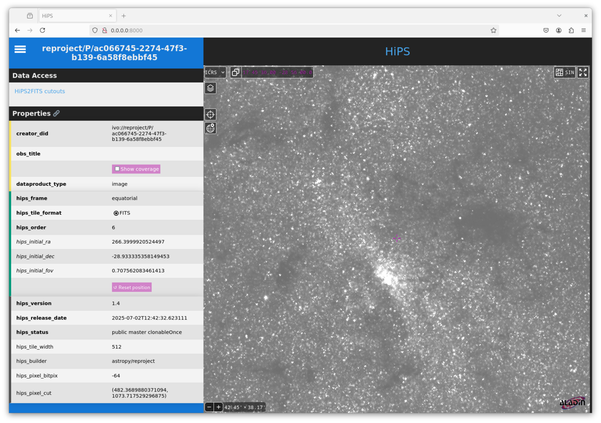

.. _hips:

************************
Generating HiPS datasets
************************

.. warning:: The hips functionality in the reproject package is
             currently experimental, so use with care and please report
             issues at https://github.com/astropy/reproject

`HiPS (Hierarchical Progressive Surveys) <https://aladin.cds.unistra.fr/hips/>`_
is a standard that can be used to representing astronomical images by a series
of tiles at different resolutions. It is used for example by `Aladin
<https://aladin.cds.unistra.fr>`_.

The **reproject.hips** sub-package includes helper functions for constructing
HiPS datasets from a variety of inputs. The main function is
:func:`~reproject.hips.reproject_to_hips`, which takes in data in a variety of
formats and types, for example FITS files, HDU objects, PNG/JPEG images with
AVM metadata, and so on.

Unlike the other reprojection functions, the output is not a file but a
directory, which contains all the tiles, as well as metadata and an
``index.html`` file which can be used to view the dataset.

Generating a HiPS dataset
=========================

We can use this with an example dataset which is a 2MASS K-band
image towards the center of our Galaxy:

    >>> from astropy.io import fits
    >>> from astropy.utils.data import get_pkg_data_filename
    >>> hdu = fits.open(get_pkg_data_filename('galactic_center/gc_2mass_k.fits'))[0]

The simplest way to call :func:`~reproject.hips.reproject_to_hips` is

    >>> from reproject import reproject_interp
    >>> from reproject.hips import reproject_to_hips
    >>> reproject_to_hips(hdu,
    ...                   output_directory='gc_2mass_k',
    ...                   coord_system_out='equatorial',
    ...                   reproject_function=reproject_interp)

The arguments passed to ``reproject_to_hips`` above are all required:

* The first argument is the data to reproject (see
  :func:`~reproject.hips.reproject_to_hips` for a list of supported data types)
* The ``output_directory`` argument is the output directory that will be
  created. To avoid any confusion, if the directory already exists, an error
  will be raised.
* The ``coord_system_out`` argument, which can be ``'equatorial'``,
  ``'galactic'``, or ``'ecliptic'``, and indicates the coordinate system in
  which the HiPS dataset will be defined.
* The ``reproject_function`` argument, which can be given any of the core
  reprojection functions including
  :func:`~reproject.reproject_interp`, :func:`~reproject.reproject_exact`, or
  :func:`~reproject.reproject_adaptive`.

Viewing the result
==================

Once :func:`~reproject.hips.reproject_to_hips` has run, you can check the
result by setting up a local web server and then viewing the result in a
browser.

The easiest way to do this is to go into the generated HiPS directory and start
a web server using Python, e.g.::

    cd gc_2mass_k
    python -m http.server

This will output something like:

  Serving HTTP on 0.0.0.0 port 8000 (http://0.0.0.0:8000/) ...

Go to ``http://0.0.0.0:8000/`` in any browser window, and you should then see
something like:

:func:`~reproject.hips.reproject_to_hips` has a number of additional options
to control the maximum order of the generated dataset, the HiPS properties,
progress reporting, and multi-threading - these are described in
:ref:`hips-options`.

Generating HiPS3D datasets
==========================

The :func:`~reproject.hips.reproject_to_hips` function can also be used to reproject
spectral cubes to spectral HiPS3D datasets. When used in this way, the following
arguments can be used to control the spectral axis:

* ``tile_depth=``: the depth of the tile in pixels, analogous to ``tile_size=``
* ``level_depth=``: the order of the spectral tile indexing, analogous to ``level=`` for the spatial dimensions
