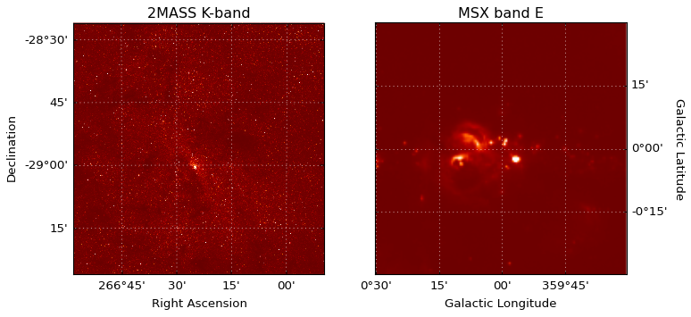
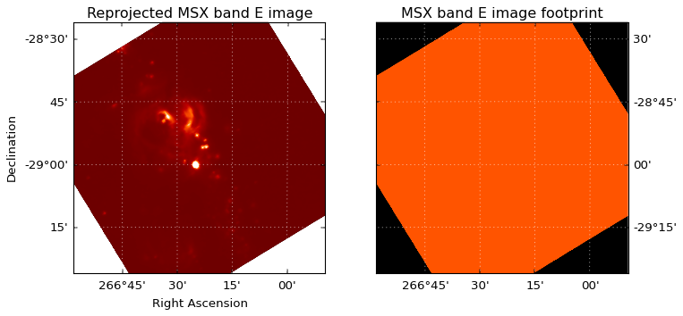

*******************************
Image reprojection (resampling)
*******************************

Introduction
============

The *reproject* package implements image reprojection (resampling) methods
for astronomical images and more generally n-dimensional data. These assume
that the WCS information contained in the data are correct. This package does
**not** do image registration, which is the process of aligning images where
one or more images may have incorrect or missing WCS.

Requirements
============

This package has the following hard dependencies:

* `Numpy <http://www.numpy.org/>`__ 1.7 or later

* `Astropy <http://www.astropy.org/>`__ 1.0 or later

* `Scipy <http://www.scipy.org/>`__ 0.9 or later

and the following optional dependencies:

* `healpy <http://healpy.readthedocs.io>`_ 1.8 or later for HEALPIX image reprojection

Installation
============

To install the *reproject* package, simply do::

    pip install reproject

.. _quickstart:

Quick start
===========

A common use case is that you have two FITS images, and want to reproject one
to the same header as the other. This can easily be done with the *reproject*
package, and we demonstrate this in the following example. We start off by
downloading two example images from `http://data.astropy.org <http://data.astropy.org>`_,
namely a 2MASS K-band image and an MSX band E image of the Galactic center::

    from astropy.io import fits
    from astropy.utils.data import get_pkg_data_filename
    hdu1 = fits.open(get_pkg_data_filename('galactic_center/gc_2mass_k.fits'))[0]
    hdu2 = fits.open(get_pkg_data_filename('galactic_center/gc_msx_e.fits'))[0]

We can examine the two images (this makes use of the
`wcsaxes <wcsaxes.readthedocs.io>`_ package behind the scenes)::

    from astropy.wcs import WCS
    import matplotlib.pyplot as plt

    ax1 = plt.subplot(1,2,1, projection=WCS(hdu1.header))
    ax1.imshow(hdu1.data, origin='lower', vmin=-100., vmax=2000.)
    ax1.coords.grid(color='white')
    ax1.coords['ra'].set_axislabel('Right Ascension')
    ax1.coords['dec'].set_axislabel('Declination')
    ax1.set_title('2MASS K-band')

    ax2 = plt.subplot(1,2,2, projection=WCS(hdu2.header))
    ax2.imshow(hdu2.data, origin='lower', vmin=-2.e-4, vmax=5.e-4)
    ax2.coords.grid(color='white')
    ax2.coords['glon'].set_axislabel('Galactic Longitude')
    ax2.coords['glat'].set_axislabel('Galactic Latitude')
    ax2.coords['glat'].set_axislabel_position('r')
    ax2.coords['glat'].set_ticklabel_position('r')
    ax2.set_title('MSX band E')

We now reproject the MSX image to be in the same projection as the 2MASS image::

    from reproject import reproject_interp
    array, footprint = reproject_interp(hdu2, hdu1.header)

The :func:`~reproject.reproject_interp` function above returns the
reprojected array as well as an array that provides information on the
footprint of the first image in the new reprojected image plane (essentially
which pixels in the new image had a corresponding pixel in the old image). We
can now visualize the reprojected data and footprint::

    from astropy.wcs import WCS
    import matplotlib.pyplot as plt

    ax1 = plt.subplot(1,2,1, projection=WCS(hdu1.header))
    ax1.imshow(array, origin='lower', vmin=-2.e-4, vmax=5.e-4)
    ax1.coords.grid(color='white')
    ax1.coords['ra'].set_axislabel('Right Ascension')
    ax1.coords['dec'].set_axislabel('Declination')
    ax1.set_title('Reprojected MSX band E image')

    ax2 = plt.subplot(1,2,2, projection=WCS(hdu1.header))
    ax2.imshow(footprint, origin='lower', vmin=0, vmax=1.5)
    ax2.coords.grid(color='white')
    ax1.coords['ra'].set_axislabel('Right Ascension')
    ax1.coords['dec'].set_axislabel('Declination')
    ax2.coords['dec'].set_axislabel_position('r')
    ax2.coords['dec'].set_ticklabel_position('r')
    ax2.set_title('MSX band E image footprint')

We can then write out the image to a new FITS file. Note that, as for
plotting, we can use the header from the 2MASS image since both images are
now in the same projection::

   fits.writeto('msx_on_2mass_header.fits', array, hdu1.header, clobber=True)

The *reproject* package supports a number of different algorithms for
reprojection (interpolation, flux-conserving reprojection, etc.) and
different types of data (images, spectral cubes, HEALPIX images, etc.). For
more information, we encourage you to read the full documentation below!

Documentation
=============

The reproject package consists of a few high-level functions to do
reprojection using different algorithms, which depend on the type of data
that you want to reproject.

.. toctree::
   :maxdepth: 2

   celestial
   healpix
   noncelestial
   footprints

Reference/API
=============

.. automodapi:: reproject
   :no-inheritance-diagram:

